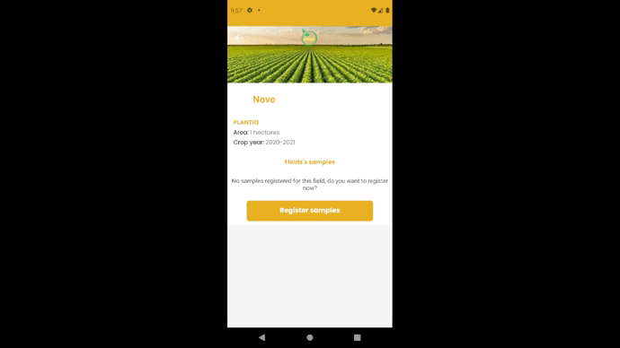

<body>
  

    <h1>Renan Alves de Medeiros</h1>
    <kbd></kbd>
    

  

</body>
  
## Introdução

Olá! Sou **Renan Alves de Medeiros**, cursante de Análise e Desenvolvimento de Sistemas pela FATEC - Prof. Jessen Vidal. Durante o processo da graduação já participei de uma iniciação científica no Instituto Nacional de Pesquisas Espaciais, agora atuo como desenvolvedor de software na Touch Health. Ao decorrer dos semestres participei das APIs - projetos realizados pela faculdade em parceria com empresas que buscam uma solução de um problema real, aplicando os conhecimentos desenvolvidos na universidade.

## Meus projetos

  
2020/1

  
  ### iPet App <a href="https://github.com/medrenan/ipet-app"></img><a>
  
  ### Parceiro Acadêmico
  FATEC - Prof. Jessen Vidal, proposto pelo professor Jean Carlos Lourenço Costa da disciplina Programação em Microinformática
  
  ### Visão do Projeto
  Desenvolver um aplicativo mobile para gerenciamento e cuidado de animais de estimação, com interface do usuário e interação com banco de dados através da leitura e persistência de dados. O aplicativo conta com cadastro de pets, doenças parasitárias, vacinas e vermifugos.
  
  ### Tecnologias Utilizadas
  
  #### MongoDB
  O banco de dados da aplicação foi construído com o MongoDB, um banco de dados não relacional orientado a documento. Ele possibilita realizar a persistência dos dados da aplicação a partir de documentos do tipo JSON e impressiona pela velocidade de processamento das transações.
  
  O MongoDB é muito vantajoso em relação a bancos de dados relacionais quando se tem um sistema com poucos recursos e que, por tratar dados diretamente como JSON, se torna um ótimo complemento à linguagem JavaScript.
  #### Express
  Express.js é um framework para aplicações baseadas em Node.js que fornece os recursos necessários para a criação de servidores web, possibilitando um design e uma construção de aplicação mais rápida e fácil.
  
  O Express.js facilita o envio e tratamento de requisições via HTTP, o que permite criar uma aplicação web de arquitetura MVC de forma simplificada com implementação de rotas e a manipulação de views e requisições. 
  
  #### React Native
  React Native é uma biblioteca Javascript criada e mantida pela Meta. Ela possibilita a criação de aplicações mobile para sistemas Android e iOS de forma nativa, renderizando código em Javascript para a linguagem de uso particular do sistema, implicando num desenvolvimento mais simples, ágil e fácil de ser mantido.
  
  Como diz o nome, React Native é baseado em outra biblioteca Javascript já muito aclamada: o React, módulo com o objetivo de facilitar o desenvolvimento interfaces de usuário em páginas web de forma dinâmica.
  
  O uso do React Native traz incontáveis benefícios para construção de aplicações mobile e ganha pontos por sua ótima performance em múltiplos sistemas de dispositivos móveis.
  
  #### Expo
  O Expo é um framework e uma plataforma para aplicações React (o que inclui o React native). Ele disponibiliza uma série de ferramentas e serviços construídos sobre plataformas nativas que auxilia no desenvolvimento, construção, implantação e iteração em ambientes Android/iOS através de uma base de códigos Javascript.
  
  Sua integração com o React Native é o que fez a plataforma ser utilizada para o deenvolvimento do projeto. Com o Expo, podemos renderizar a aplicação em qualquer celular através da leitura de um QR Code e assim acompanhar o desenvolvimento em tempo real de forma direta e com pouca configuração. 
  
  #### NodeJs
  Node.js é um software que permite a execução de códigos Javascript fora de um navegador web, que é seu interpretador padrão. É projetado para construir aplicações web escaláveis, sendo um ambiente de servidor extremamente eficiente para o desenvolvimento rápido e limpo de aplicações Javascript.
  
  Sua flexibilidade com o gerenciamento de pacotes e softwares NPM (Node Package Manager) da ao Node.js um potencial para ser utilizado em diversas situações. Além disso, é um ambiente leve pouco custoso e eficiente e conta com suporte das principais empresas na área de tecnologia, como a Google, Amazon e Microsoft.
  
  #### Contribuições Pessoais
  
  Fui responsável pelo desenvolvimento backend da aplicação. Sendo neste semestre meu primeiro contato com programação web e com diversos dos recursos utilizados, como a linguagem Javascript e o React Native, tive de aprender o uso eficiente das ferramentas da aplicação durante o próprio desenvolvimento.
  
  Como desenvolvedor back-end, construí a lógica e os serviços da aplicação com o uso das tecnologias citadas, pesquisando nas documentações e em tutoriais os diferentes tipos de implementações e os usos mais adequados ao projeto de forma com que o problema apresentado fosse resolvido de forma eficiente. Desenvolvi os serviços que se comunicam com a tela do aplicativo, com persistência, leitura, escrita e remoção de dados no banco de dados da aplicação utilizando uma arquitetura de model, view e controller.
  
  Apesar de ser desenvolvedor back-end, também contribuí com o desenvolvimento de componentes da interface do usuário, aplicando lógicas à renderização das páginas da aplicação e tratando os dados recebidos.
  
  O versionamento do projeto num repositório na nuvem, sendo utilizado o GitHub, também foi uma das minhas atribuições e da equipe. Além de contribuir com documentações necessárias para as entregas e auxiliar no gerenciamento da equipe com o uso da metodologia Kanban, veiculada pela plataforma Trello.
  
  #### Hard Skills
  
  - **Aplicação de arquitetura MVC em uma aplicação web**: Sei fazer com autonomia
  - **Desenvolvimento de aplicações back-end em Node.js**: Sei fazer com ajuda.
  - **Versionamento de repositório git**: Sei fazer com autonomia.
  - **React com HTML/CSS**: Sei fazer com autonomia.
  
  #### Soft Skills
  
  - **Comunicação**: foi fundamental para o desenvolvimento do projeto e a integração da equipe, onde todos se conheciam há pouco tempo e possuíam niveis diferentes de conhecimento. Foi necessário principalmente no pareamento dos conhecimentos do time, na organização do fluxo de desenvolviemto e nas apresentações das entregas.
  - **Resolução de problemas**: durante qualquer processo de desenvolvimento é natural que exista conflitos e problemas internos ou externos, sejam eles técnicos ou de gestão, por isso é necessários buscar formas eficientes de resolve-los. Foi fundamental durante o processo inteiro de desenvolvimento do API.
  - **Ensino/Treinamento**: como foi citado no ponto de *Comunicação*, a equipe possuia diferentes níveis de conhecimentos técnicos, por isso, o ensino e o treinamento foi vital no desenvolvimento do projeto. Como houve facilidade da minha parte no entendimento das tecnologias, que aprendi praticando e com o auxílio de outros membros da equipe, pude repassar o conhecimento adquirido treinando outros membros da equipe e auxiliando em dúvidas.

  
2020/2

  
  ### eJourney <a href="https://github.com/medrenan/PI_2020.2"></img><a>
  
  ### Parceiro Acadêmico
  IACIT Soluções Tecnológicas
  
  ### Visão do Projeto
  Desenvolver um aplicativo de gerenciamento e controle da jornada de trabalho dos motoristas da empresa parceira de forma parametrizável, aplicando funcionalidades de planejamento, acompanhamento e controle de serviços.
  
  ### Tecnologias Utilizadas
  
  #### Java
  Java é uma linguagem de programação de paradigma orientado a objetos desenvolvida na década de 90. Uma das mais consolidadas no meio da programação, é uma linguagem de propósito geral com a intenção de ser capaz de rodar em qualquer plataforma que suporte a tecnologia, utilizando o JVM (Java Virtual Machine) como compilador da linguagem.
  
  Neste projeto utilizamos o Java para desenvolver o sistema, implementando a orientação a objetos e aproveitando a biblioteca JavaSQL pra fazer a conexão com o banco de dados da aplicação.
  
  #### PostgreSQL
  O banco de dados do sistema proposto foi construido com o PostgreSQL, um sistema gerenciador de banco de dados objeto relacional que usa e estende a linguagem SQL(Strucutred Query Language), combinando diversas características para guardar e escalar dados com segurança.
  
  A partir do código Java foi feita a conexão com o PostgreSQL utilizando a tencologia JDBC, o que permitia cadastrar, ler, atualizar e remover os dados das tabelas do banco através da lógica implementada no sistema.
  
  #### Java Swing
  A interface gráfica da aplicação foram construídas utilizando o framework Java Swing, um toolkit para Java que renderiza os componentes por conta própria compatível com o Abstract Window Toolkit, que depende do código nativo da plataforma.
  
  Como requisito do cliente, foram desenvolvidas telas de login e cadastro de novos usuários e telas de busca e cadastro de funcionários, veículos e de entregas em andamento e realizadas.
  
  Apesar de ser uma teconologia mais antiga e menos utilizada, ela traz alguns benefícios como sua gama enorme de controles de personalização e a capacidade de ser compilada em máquinas que suportem Java. No entanto, sua performance pode ser lenta devida a alta abstração do framework.
  
  #### Contribuições Pessoais
  
  Fui responsável pelo desenvolvimento backend da aplicação. Por ser o segundo semestre do curso já havia construído uma base de conhecimentos necessários para desenvolver o projeto, embora o uso de tecnologias diferentes das apresentadas anteriormente tenha dificultado o processo de desenvolvimento.
  
  Sendo responsável pelo desenvolvimento do back-end do sistema, implementei serviços de cadastro, leitura e remoção de dados coletados pela aplicação. Também prestei apoio na criação das interfaces gráficas com o Java Swing e no versionamento do projeto com a tecnologia Git.
  
  Contudo, vale acrescentar que por ser o primeiro contato com uma empresa terceira, que foi a solicitante do produto a ser entregue, o desafio foi diferente do projeto anterior pois deveríamos atender os requisitos necessários e ter uma comunicação ativa com o cliente a fim de produzir entregas de valores a cada etapa do processo, por isso ajudei a gerenciar a equipe utilizando a metodologia ágil Scrum.

  
  || 
  |:--:| 
  | *Tela de cadastro de Motoristas, renderizada com o Java Swing* |
  

  
  #### Hard Skills
  
  - **Desenvolvimento com integração a um banco de dados relacional**: Sei fazer com autonomia
  - **Desenvolvimento de aplicações back-end em Java**: Sei fazer com ajuda.
  - **Versionamento de repositório git**: Sei fazer com autonomia.
  - **Desenvolvimento de GUI com Java Swing**: Sei fazer com autonomia.
  
  #### Soft Skills
  
  - **Comunicação**: uma habilidade que está em constante desenvolvimento, e não foi diferente nesta etapa onde foi necessário apresentar o projeto para o cliente e professores avaliadores. Além de ser necessário para manter um esquema organizacional eficiente, ativo e funcional entre os integrantes da equipe. 
  - **Controle de Tempo**: por ser o primeiro projeto em parceria com um cliente real, uma empresa parceira da universidade, com prazos mais curtos para um desenvolvimento mais complexo e com mais requisitos, o controle do tempo foi necessário para cumprir com as entregas nos prazos determinados, buscando otimizar a eficiência.

  
2021/1

  
  ### nEDUC <a href="https://github.com/DevSlim001/API_NEDUC"></img><a>
  
  ### Parceiro Acadêmico
  NESS Health
  
  ### Visão do Projeto
  Com a pandemia do COVID-19, começamos a buscar cada vez mais formas de interagir de forma segura com outras pessoas, graças a tecnologia esse relacionamento à distância não foi um problema. Hoje em dia, trabalhamos de casa, falamos com nossos familiares por chamada de vídeo, fazemos reuniões e seminários por plataformas da web. Da mesma forma que tudo se adaptou durante esse período, com a educação e o ensino não podia ser diferente.
  
  Visando estes fatores, a empresa parceira, e a FATEC de São José dos campos propôs o desafio de achar uma solução para facilitar a vida de estudantes com uma plataforma de ensino remoto com praticidade e facilidade.
  
  ### Tecnologias Utilizadas
  
  #### Spring Framework
  Spring é um framework Java amplamente utilizado pela comunidade que otimiza o processo de desenvolvimento web em Java, possibilitando um maior domínio do projeto que está sendo desenvolvido com um suporte à infraestrutura direto na aplicação, permitindo que os desenvolvedores possam se concentrar na parte lógica da aplicação, sem se preocupar com configurações de ambiente.
  
  A ferramente possui uma plenitude de funcionalidades, se destacando entre elas o Spring Data, módulo responsável pela conexão da aplicação com um banco de dados que possibilita trabalhar com mais facilidade por fazer essa integração de forma mais direta.
  
  Também é notável o Spring MVC, tecnologia que facilita o desenvolvimento Web em Java permitindo construir uma aplicação web ou API Rest de forma simples e intuitiva, gerando aplicações robustas e flexíveis.
  
  O Spring foi a tecnologia chave do projeto, utilizada para construir as rotas de integração com banco de dados e a comunicação com a interface gráfica do usuário.
  
  #### MySQL
  O banco de dados do sistema proposto foi construido com o MySQL, um sistema de gerenciamento de banco de dados, que utiliza a linguagem SQL como interface para adicionar, acessar e processar os dados de uma aplicação. É uma tecnologia rápida, confiável e simples de se utilizar.
  
  Com o MySQL gerenciamos as tabelas do banco de dados da aplicação de forma mais simples a partir do MySQL Workbench, uma interface gráfica que permite rodar scripts SQL para tratar a base de dados da aplicação.
  
  #### HTML + CSS
  A interface do usuário foi construída utilizando HTML com CSS, tecnologias de desenvolvimento front-end que renderizam os componentes de uma aplicação a partir do HTML e os estiliza com o uso de CSS. As tecnologias combinadas permitem construir páginas web responsivas e funcionais, que são diretamente interpretadas pelos navegadores.
  
  Com o uso de HTML também foi possível fazer a conexão com o controlador do sistema, a fim de direcionar botões e atalhos presentes nas telas para serviços construídos no backend da aplicação e apresentar os dados encontrados dinamicamente.
  
  #### Contribuições Pessoais
  

    
Product Owner

  Neste projeto pude ser o Product Owner da equipe, portanto além das responsabilidades de desenvolvedor, também fiquei responsável pelo contato direto com o cliente, apresentando o que foi construído durante a sprint e num processo contínuo de validação e negociação de prazos e requisitos. Também tive o encargo de sanar as dúvidas da equipe durante o projeto, sempre comunicando a melhor forma de seguir com o projeto de acordo com as demandas do cliente.

  Como Product Owner, construí efetivamente os recursos da metodologia Scrum para a posição, definindo o Product Backlog, gerando os gráficos de burndown e parametrizando a equipe em relação do estado de desenvolvimento para com os requisitos necessários e funcionalidades a serem entregues que foram previamente negociadas.
  

  

    
Desnovlvedor Back-End

  
  Também atuei como desenvolvedor, principalmente no back-end da aplicação. Criando rotas de integração de serviços de processamento dos dados fornecidos pela tela. Neste projeto, principalmente, compreendi melhor aspectos importantes para um desenvolvedor web, tanto pelo contato com o produto quanto com as tecnologias empregadas e seus usos, como a construção das rotas e a definição de um banco de dados relacional funcional.
  

  

  
  || 
  |:--:| 
  | *Gif demonstrando o funcionamento da tela de Cursos da aplicação* |

  

  
  #### Hard Skills
  
  - **Desenvolvimento Web utilizando Spring MVC**: Sei fazer com autonomia
  - **Construção de interface gráfica responsiva e funcional**: Sei fazer com autonomia.
  - **Configuração e implementaçãod de serviços de conexão com Banco de Dados utilizando Spring Data**: Sei fazer com autonomia.
  - **Construção e manutenção de Banco de Dados relacional**: Sei fazer com autonomia.
  
  #### Soft Skills
  
  - **Visão Analítica**: para compreender as demandas do cliente e traçar um trajeto efetivo e viável para facilitar o processo de desenvolvimento da equipe foi necessário aprimorar a visão analítica do projeto, uma habilidade crítica para qualquer proceso lógico a ser desenvolvido. Pude aprimorar esta habilidade de forma prática e contínua no decorrer dos Projetos Integradores, mas se provou muito necessária ao desempenhar o cargo de Product Owner.
  - **Tomada de Decisões**: muitas vezes o melhor caminho pode não ser o mais claro ou o mais fácil, portanto a tomada de decisões de forma assertiva foi uma habilidade crítica para o desenvolvimento do projeto.
  - **Habilidades Técnicas**: o estudo de novas tecnologias foi fundamental para compreender a complexidade do projeto e os requerimentos do cliente, que possuía um alto nível técnico.

  
2021/2

  ### ShipsDocument <a href="https://github.com/developersapi/Sistema-Web-com-Regra-de-Negocio/tree/sprint04"></img><a>

  ### Parceiro Acadêmico
  Embraer
  
  ### Visão do Projeto
  O desafio do projeto foi com base em um problema real enfrentado na Embraer; na empresa toda a aeronave produzida conta com um manual operacional que demonstra o funcionamento de suas peças. No entanto, o manual é criado e mantido de forma manual, utilizando planilhas para fazer o controle do lançamento de manuais atualizados. Além desta prática necessitar de bastante tempo devido a complexidade, implica no surgimento de erros nos manuais.

  A solução foi elaborar uma aplicação desktop que, comunicando com um servidor interno da empresa, seja capaz de criar, manipular e dispor os manuais para os clientes de fomra facilitada.

  Os manuais dispõem de um padrão específico adotado na empresa, chamado de Codelist: por este padrão, é realizado todo o tratamento dos repositórios de manuais para cada aeronave. Visto que uma sessão do documento de determinada operação pode precisar ser disponibilizada em outras aeronaves que utilizam a mesma peça e funcionalidade, o sistema é responsabilizado por tratar automaticamente, a partir do valor da codelist cadastrada, a geração do manual para cada aeronave.
  
  ### Tecnologias Utilizadas
  
  #### Spring Framework
  Spring é um framework Java amplamente utilizado pela comunidade que otimiza o processo de desenvolvimento web em Java, possibilitando um maior domínio do projeto que está sendo desenvolvido com um suporte à infraestrutura direto na aplicação, permitindo que os desenvolvedores possam se concentrar na parte lógica da aplicação, sem se preocupar com configurações de ambiente.
  
  A ferramente possui uma plenitude de funcionalidades, se destacando entre elas o Spring Data, módulo responsável pela conexão da aplicação com um banco de dados que possibilita trabalhar com mais facilidade por fazer essa integração de forma mais direta.
  
  Também é notável o Spring MVC, tecnologia que facilita o desenvolvimento Web em Java permitindo construir uma aplicação web ou API Rest de forma simples e intuitiva, gerando aplicações robustas e flexíveis.
  
  O Spring foi a tecnologia chave do projeto, utilizada para construir as rotas de integração com banco de dados, adotando a lógica necessária para o tratamento dos manuais, e a comunicação com a interface gráfica do usuário.
  
  #### PostgreSQL
  O banco de dados do sistema proposto foi construido com o PostgreSQL, um sistema de gerenciamento de banco de dados, que utiliza a linguagem SQL como interface para adicionar, acessar e processar os dados de uma aplicação. Foi utilizado para fazer a persistência dos dados.
  
  #### AngularJS
  A interface do usuário foi construída utilizando AngularJS, um framework front-end javascript que oferece um padrão de comopnentização de elementos HTML, facilitando o trabalho do desenvolvimento e integração das telas.

  #### Contribuições Pessoais
  
  Atuei como desenvolvedor back-end da aplicação, sendo responsável pela construção da lógica de tratamento dos dados recebidos da tela, aplicando as regras de negócio do cliente para a construção, gerencimanto e publicação dos manuais das aeronaves. Incluindo também a modelagem do banco de dados, mapeamento das entidades ORM e criação das rotas da API de controle dos manuais.
  
  #### Hard Skills
  
  - **Java Spring | Construção das entidades, serviços e controles**: sei fazer com autonomia
  - **Padrão de desing de projeto**: sei fazer com autonomia
  
  #### Soft Skills
  
  - **Levantamento de requisitos**: além do desenvolvimento, contribuí com o levantamento de requisitos da aplicação, procurando compreender a visão do cliente sobre o projeto para implementar uma solução que o atenda.
  - **Comunicação**: por ter se tratado de um projeto com um desenvolvimento conturbado, a comunicação efetiva foi chave para o trabalho da equipe.

  
2022/1

  ### eFOL <a href="https://github.com/medrenan/eFol-app"></img><a>

  ### Parceiro Acadêmico
  Embraer
  
  ### Visão do Projeto
  O desafio do projeto foi com base em um problema real enfrentado na Embraer; mesmo após a venda de uma aeronve é necessário um controle de qualidade continuo por se tratar de um veículo onde a segurança é um ponto crítico. Com isso, certas aeronaves podem necessitar de um _recall_ ou uma alteração no funcionamento de algumas de suas ferramentas ou componentes.

  Visando uma solução para estre problema, a empresa adota a prática de emitir FOLs (Flight Operation List) para aeronaves que necessitem de manutenção devido a o mau funcionamento de algum de seus componentes. No entanto, para que o cliente acesse estes registros é necessário um extenso processo de consulta num sistema interno da empresa.

  Pensando nisso, o desafio foi criar um aplicativo que notifique cada cliente a situação atual das aeronaves que possui e permita a consulta faciltiada dos registros criados para sua aeronave.

  Foi necessário implementar:
  - Acesso aos clientes já cadastrados em uma base de dados da empresa;
  - Visualização de seus equipamentos;
  - Visualizacão das FOLs
  - Notificação de atualizações de FOLs

  Aos administradores do sistema é disponibilizado um sistema web para gerenciamento das FOLs lançadas.

  || 
  |:--:| 
  | *Gif demonstrando o funcionamento da aplicação* |
  
  ### Tecnologias Utilizadas
  
  #### Spring Framework
  Spring é um framework Java amplamente utilizado pela comunidade que otimiza o processo de desenvolvimento web em Java, possibilitando um maior domínio do projeto que está sendo desenvolvido com um suporte à infraestrutura direto na aplicação, permitindo que os desenvolvedores possam se concentrar na parte lógica da aplicação, sem se preocupar com configurações de ambiente.
  
  A ferramente possui uma plenitude de funcionalidades, se destacando entre elas o Spring Data, módulo responsável pela conexão da aplicação com um banco de dados que possibilita trabalhar com mais facilidade por fazer essa integração de forma mais direta.
  
  Também é notável o Spring MVC, tecnologia que facilita o desenvolvimento Web em Java permitindo construir uma aplicação web ou API Rest de forma simples e intuitiva, gerando aplicações robustas e flexíveis.
  
  O Spring foi a tecnologia chave do projeto, utilizada para construir as rotas de integração com banco de dados, adotando a lógica necessária para o tratamento dos manuais, e a comunicação com a interface gráfica do usuário.
  
  #### PostgreSQL
  O banco de dados do sistema proposto foi construido com o PostgreSQL, um sistema de gerenciamento de banco de dados, que utiliza a linguagem SQL como interface para adicionar, acessar e processar os dados de uma aplicação. Foi utilizado para fazer a persistência dos dados.
  
  #### React Native
  A interface do usuário foi construída utilizando React Native, um framework front-end javascript para desenvolvimento mobile que oferece um padrão de comopnentização de elementos HTML, facilitando o trabalho do desenvolvimento e integração das telas além de contar com funcionalidades específicas disponíveis em um aparelho celular.

  #### Contribuições Pessoais
  
  Atuei como desenvolvedor back-end da aplicação, sendo responsável pela construção da lógica de tratamento dos dados recebidos da tela, aplicando as regras de negócio do cliente no serviço do aplicativo para: o cadastro e login dos clientes na plataforma, visualização das FOLs aplicando filtros na busca.

  No serviço do admnistrador, criei toda a lógica de cadastro e atualizações de FOLs no sistema.
  
  #### Hard Skills
  
  - **Java Spring | Construção das entidades, serviços e controles**: sei fazer com autonomia
  - **Padrão de desing de projeto**: sei fazer com autonomia
  - **React | Construção das telas do sistema de administração**:  sei fazer com autonomia
  - **React Native**: sei fazer com ajuda
  
  #### Soft Skills
  
  - **Liderança**: durante o desenvolvimento do projeto, estive liderando o time de desenvolvimento back-end que atuou para construir os serviços da aplicação
  - **Gerenciamento de Equipe**: como adotamos tecnologias novas durante este projeto, a equipe teve dificuldade em trabalhar no desenvolvimento das telas do aplicativo. Defini tarefas e prestei suporte as equipes buscando entender como funciona as ferramentas e repassar para a equipe facilitando o desenvolvimento.

2022/2

  
### SoyIA <a href="https://github.com/medrenan/SoyIA"></img><a>

### Parceiro Acadêmico
  VISIONA
  
### Visão do Projeto

O desafio proposto foi o de dar continuidade a um projeto desenvolvido por outra turma para a Visiona, o eSoja: um aplicativo mobile que oferece funcionalidades para donos de talhões de soja para realizar o controle de suas plantações, registrar estágios das plantações e calcular estimativas de produção. Através do aplicativo o agricultor realiza o registro da amostra das plantações para que o aplicativo estime a produção da plantação, informando manualmente a quantidade de sementes de soja de cada registro.

Visto que o processo de contagem dos grãos de soja consome muito tempo do agricultor, o desafio foi implementar uma nova funcionalidade ao projeto: a contagem automática de grãos de soja através do uso de inteligência artificial de reconhecimento de imagem.

Com isso, é necessário que o usuário apenas fotografe a planta de soja e o sistema realiza a contagem dos grãos automaticamente, de forma precisa.

  || 
  |:--:| 
  | *Gif demonstrando o funcionamento da aplicação* |

### Tecnologias Utilizadas

#### Tensorflow

TensorFlow é uma biblioteca de código aberto para aprendizado de máquina e desenvolvimento de redes neurais. Ela é projetada para suportar a construção e treinamento de modelos de aprendizado profundo, utilizando uma estrutura flexível baseada em grafos computacionais. O TensorFlow oferece alto desempenho e escalabilidade, permitindo o treinamento distribuído de modelos em ambientes de computação paralela, sendo uma ferramenta amplamente utilizado em projetos de inteligência artificial e pesquisa, abrangendo áreas como visão computacional, processamento de linguagem natural, reconhecimento de fala e muito mais.

#### Keras

Keras é uma biblioteca de aprendizado profundo em Python que fornece uma interface simples e eficiente para construir e treinar redes neurais. É conhecida por sua facilidade de uso e integração com outras bibliotecas, como TensorFlow, permitindo a implementação rápida de modelos complexos de aprendizado profundo.

#### Python

Python é uma linguagem de programação de alto nível e interpretada, amplamente utilizada em inteligência artificial. Sua sintaxe clara e bibliotecas como TensorFlow e scikit-learn facilitam o desenvolvimento de algoritmos de aprendizado de máquina, processamento de linguagem natural e visão computacional.

#### PostgreSQL

O banco de dados do sistema proposto foi construido com o PostgreSQL, um sistema de gerenciamento de banco de dados, que utiliza a linguagem SQL como interface para adicionar, acessar e processar os dados de uma aplicação. Foi utilizado para fazer a persistência dos dados.

#### Flask
  
Flask é uma biblioteca em Python para desenvolvimento de aplicações web. Ela é leve e fácil de usar, permitindo a criação rápida de aplicativos web simples e escaláveis. Flask fornece um conjunto de ferramentas e recursos para o roteamento de URLs, manipulação de solicitações e respostas, além de suporte a templates para renderização de páginas.
  
### Contribuições Pessoais

Neste projeto fui o Master, sendo responsável pelo gerenciamento completo da equipe, criando as tarefas e organizando os processos de desenvolvimento para realizar as entregas. No gerenciamento da equipe está incluso o controle de horas, a divisão de tarefas e responsabilidades, a facilitação da comunicação das partes do projeto e o levantamento de requisitos junto com o Product Owner.

Utilizando métodos consolidados de metodoligas ágeis como Scrum e Kanban, o processo de desenvolvimento foi controlado de forma eficiente.

Também contribuí no desenvolvimento da aplicação, auxiliando a equipe de desenvolvimento quando necessário.

### Hard Skills
- **Metodologias Ágeis | Scrum, Kanban**: sei fazer com autonomia
- **ClickUp | Ferramenta para gestão de projetos**: sei fazer com autonomia

### Soft Skills
- **Liderança**: liderando a equipe tivemos sprints eficientes com poucas dificuldades nas entregas e no processo de desenvolvimento.
- **Harmonia**: através também da liderança, auxiliei toda a equipe a trabalhar de forma harmoniosa para que não houvesse conflitos ou impedimentos durante o processo de desenvolvimento.
  

## Principais Conhecimentos
### Java
### Spring
### React
### TypeScript
### Bancos de Dados Relacionais

## Contato
  - [**Linkedin**](https://www.linkedin.com/in/medrenan/)
  - [**GitHub**](https://github.com/medrenan)
